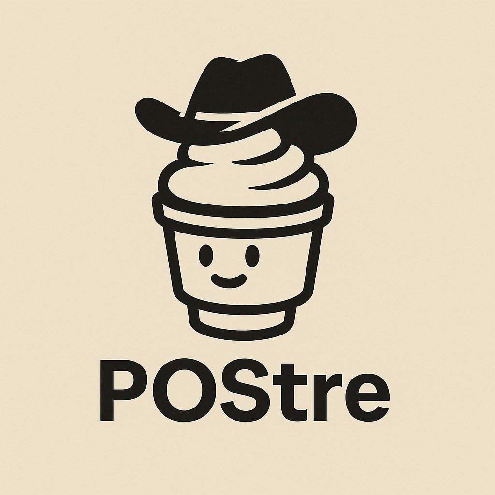

# POStre Backend API

<p align="center">
  
</p>

This is the backend API for the POStre project - a point of sales system built for local restaurants

---

## Installation

1. **Clone the repository:**

```bash
git clone https://github.com/DuraNet/postre_backend.git
cd postre_backend
```

2. **Install dependencies:**

```bash
npm install
```

3. **Create the .env file:**

Create the .env file at the root of the project using the template below

### Env file

Here's an example of the .env file:

```bash
# Env Variables
isPROD=
DB_HOST=
DB_PORT=
DB_USERNAME=
DB_PASSWORD=
DB_NAME=
JWT_SECRET=
JWT_EXPIRES=
```

4. **Running the project:**

### Development

```bash
npm run start:debug

```

### Production

Change the isPROD env variable to **true**
then

```bash
npm run build
npm run start:prod
```

### Docker (For CI/CD pipelines)

Requirements:
Install docker at: <https://www.docker.com/>

1. **Build the docker image:**

```bash
docker build -t postre-backend .
```

2. **Run the container:**

```bash
docker run --env-file .env -p 3000:3000 postre-backend

```

MIT License

Copyright (c) 2025 [Duranet]
